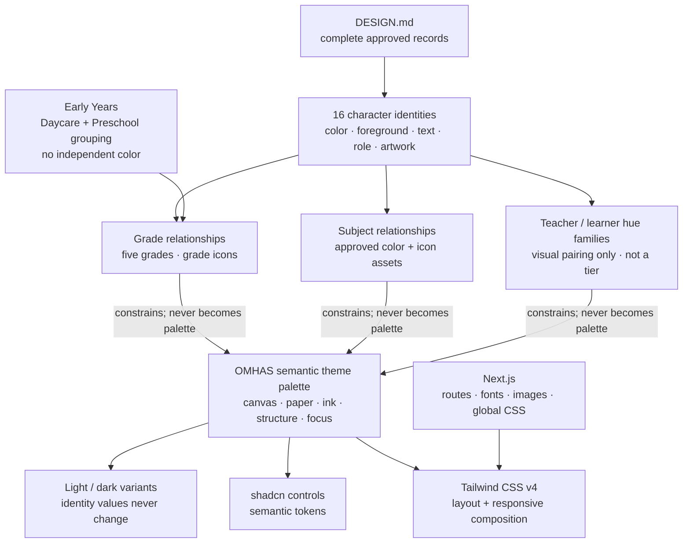

# Old MacDonald Had a School Design System

## Overview

This system translates the official character record into a framework-neutral contract for websites, presentations, printable resources, editorial pages, and other generated artifacts.

It serves an educator-facing curriculum product. Its job is to make a specific learning purpose and the practical material needed to lead it easy to understand at a glance. The visual world is not children’s entertainment and not a generic dashboard: it is a welcoming, capable working environment for planning and leading real learning experiences.

**This file is the design source of truth.** It carries the complete character, grade, and subject design records — colors, foregrounds, curriculum relationships, icon bindings, and canonical artwork paths. `content/pages/branding/characters.mdx` is a rendered brand page that consumes this record and must never redefine it. `app/globals.css` and `app/brand-assets.css` are the implementation bindings. `public/` is storage, not authority. Do not infer design rules from route copy, filenames, code comments, contact sheets, or available-but-unregistered assets.

When sources conflict:

1. Preserve the exact record documented in this file.
2. Use CSS only to bind those rules to current values and files.
3. Stop for approval rather than inventing, optimizing, excluding, or silently substituting.

## Identity relationship contract

This diagram defines the design relationship; the tables below carry the exact values.

- Identity colors are locked requirements, not the interface palette.
- Grade color stays on grade-owned navigation, rails, edges, and artifacts.
- Subject color/icon represents curriculum meaning; never infer it from a nearby character.
- Character color/felt appears only with that character's owned identity.
- Shared controls use OMHAS semantic tokens.
- Missing or conflicting relationships stop for approval.

## Design thesis

Create a living classroom working wall, not a generic dashboard and not a cork-themed interface.

The working wall supports preparation. A teacher should be able to find the lesson purpose, the next useful action, and the material they need before noticing decorative detail. Character art and mixed-media texture make the work inviting and memorable, but they never displace instructional clarity or turn an age-appropriate activity into a worksheet-shaped page.

Foreground information behaves like a real teaching artifact: paper, note, badge, portrait, textile patch, or clipped workspace. It sits on a supporting surface and looks installed there. Cork is one valid support. Dark leather, denim, paper, card, and other approved materials can also support a composition when their documented role fits.

The attachment relationship is the signature move:

- A fastener crosses the foreground object's edge.
- The same fastener visibly meets the supporting surface.
- Shadows, overlap, slight offset, and restrained rotation clarify depth.
- A floating fastener, decorative fastener inside an object, or fastener with no supporting surface is invalid.
- Not every object needs a fastener. Use one only when attachment is structurally credible.

Educational meaning leads decoration. Choose curriculum, grade, character, material, and icon because each has a documented job.

## Experience principles

### Academic meaning first

Lead with academic field or learning action before character name. Character identity supports the learning context; it does not replace it.

Lead a teaching resource with its lesson purpose and learner group as well. A song, story, video, activity, or printable must look connected to the learning it serves, rather than presented as free-floating content.

### Developmentally appropriate material

The design must match the teaching format to the learners. Early-years resources prioritize instructor-led songs, stories, sensory play, movement, visual cues, and observation. Daycare and Preschool materials remain highly visual and group-oriented. Worksheets, written responses, and formal-looking practice are reserved for a specific Kindergarten-to-Grade-2 learning purpose; they are never the default visual language for younger children.

### One semantic owner

Character color and felt belong only to that character. Grade color belongs to that grade. Subject color and icon belong to curriculum meaning. Generic navigation and controls use shared semantic UI roles, never character texture.

### Readable work on paper

Paragraphs, instructions, form labels, tables, learner work, and dense teacher information use paper. Fabric is an attached identity specimen or owned object, never the default reading surface.

### Real artifacts, live content

Text remains live and editable. Use repeating paper surfaces behind live content. Never bake an entire responsive card, paragraph, or control into a raster image.

### Warm, capable, specific

Tone feels welcoming, handmade, organized, and teacher-useful. Avoid childish clutter, sterile enterprise dashboards, decorative randomness, and nostalgia without educational function.

## Composition grammar

Build compositions in four layers:

1. **Environment** — page, slide, or sheet canvas.
2. **Support** — leather, denim, cork, paper, card, or another approved structural surface.
3. **Artifact** — readable paper, character-owned patch, badge, curriculum card, photograph, or illustration.
4. **Attachment** — paperclip, masking tape, binder clip, push pin, or another approved fastener crossing artifact and support.

At least one composition in a branded artifact should demonstrate the support–artifact relationship. Do not cover every surface with texture. Give readable artifacts calm space.

Use overlap to show construction, not to hide information. Keep text, controls, faces, icons, and focus indicators clear of fasteners. Small rotations may suggest a placed object; they must never reduce alignment, legibility, or apparent quality.

### Depth

- Support surfaces sit at the lowest content plane.
- Paper and textile artifacts lift one plane with border and restrained shadow.
- Fasteners sit above the artifact edge.
- Dialogs, menus, and focus indicators remain functionally above decorative layers.
- Do not use glossy glassmorphism, neon glow, or deep synthetic 3D effects.

## Materials

### Paper

Default readable surface. Cardboard paper supports cards and work stages. Ruled paper supports prose aligned to its repeating rule. Grid paper supports diagrams, number work, and planning. Repeats extend as content grows.

For ruled paper on web, current implementation evidence uses a 28 px mobile rule interval and 32 px from the existing small-screen layout threshold. Other media should preserve line-to-text alignment rather than copy those pixel values blindly.

### Cork

Working board holding attached paper, fabric, and fasteners. Use semantic repeating texture for responsive surfaces. Fixed-composition board exports are review references, not stretchable page backgrounds.

### Leather

Dark structural surface for shared header, footer, attached edge treatments, and the homepage base. Paper headings and lesson lists may be clipped or taped to it.

### Denim

Presentation-board textile behind installed workspaces. It is a support, not a generic content card.

### Felt and woven cloth

Felt requires a semantic owner. Character felt uses that character's approved identity. Grade patches use the documented grade mapping. Neutral woven cloth is an attached textile object, never the wall behind pinned notes. Never use a character texture for unrelated subjects, navigation, or generic controls.

### Asset boundaries

Asset paths stay behind semantic names. Do not paste file URLs into components or generation prompts when a semantic asset role exists. Contact sheets and composites are references, not production surfaces. Availability does not grant permission to invent a role. No asset may be excluded, substituted, renamed, deleted, or classified as non-production without explicit approval.

## Colors

Semantic roles come before raw color values.

### Foundation roles

- Canvas: warm cream.
- Readable surface: warm paper.
- Primary ink: very dark blue-green.
- Structural dark: deep navy.
- Border and joinery: warm wood.
- Focus and highlight: curriculum gold.
- Destructive state: warm rose.

Physical-material colors remain stable across themes. A dark display mode may change surrounding UI roles, but paper remains paper, navy remains navy, and character identity colors remain exact.

### Change authority

Change order runs in one direction: update this file, bind the exact color in `app/globals.css` (`--characters-*-color`, `--grade-*-color`, `--subject-*-color`), bind artwork roles in `app/brand-assets.css`, store unchanged artwork in `public/`, consume `data-character` plus the asset-role class, then verify subject, grade or scope, role, paths, token, contrast, and crop. No other file may originate a character, grade, or subject color.

### Character identity: complete record

Sixteen identities: eight staff, eight learners. Every reference presents the academic lead and grade or scope before the less-prominent character name, then the exact token, value, and canonical artwork. Never derive, recolor, optimize, or substitute these values. Scout and Sam remain distinct. A learner may share an academic lead with staff but never inherits that staff member's grade.

#### Staff

| Character | Species · role | Grade or scope | Academic lead | Color token | Color | Foreground | Bound subject icon |
| --- | --- | --- | --- | --- | --- | --- | --- |
| Old MacDonald | Human · Principal and music teacher | Kindergarten | Music · Community · Literacy | `--characters-old-macdonald-color` | `#A66A32` | `#FEFCE8` | `music-icon` |
| Miss Puddles | Duck · Daycare teacher and swim instructor | Daycare | Early Learning · Movement · SEL | `--characters-miss-puddles-color` | `#F6AF32` | `#1E2A38` | `early-learning-icon` |
| Mr Rusty | Horse · Dance teacher | Kindergarten | Music · Rhythm · Counting | `--characters-mr-rusty-color` | `#267CBA` | `#FEFCE8` | `music-fiddle` |
| Miss Hayley | Human · Music, singing and drama teacher | Grade 1 | Literacy · Music · Drama | `--characters-miss-hayley-color` | `#D95C86` | `#1E2A38` | `drama-storytelling-icon` |
| Mr Sam | Pig · Math, science and building teacher | Whole school | Mathematics · Science · Engineering | `--characters-mr-sam-color` | `#1D8787` | `#FEFCE8` | `math-building-icon` |
| Mr Maisy | Cow · Physical education and health teacher | Grade 2 | Physical Education · Health | `--characters-mr-maisy-color` | `#D81D24` | `#FEFCE8` | `physical-education-icon` |
| Mr Puddles | Duck · Art and photography teacher | Whole school | Science · Visual Arts · Communication | `--characters-mr-puddles-color` | `#5367B5` | `#FEFCE8` | `art-photography-icon` |
| Miss Maisy | Cow · School secretary, gardening lead and cooking teacher | Preschool | Community · Science · Food & Health | `--characters-miss-maisy-color` | `#5D8164` | `#FEFCE8` | `gardening-health-icon` |

Staff curriculum contributions are part of identity and travel with the record:

| Character | Curriculum contributions |
| --- | --- |
| Old MacDonald | Community: gatherings, processions, assembly. Literacy: storytime. Music: whole-school singing, banjo and guitar. |
| Miss Puddles | Early learning: circle time and fingerplay songs. Visual arts: art table. Physical development: movement games and swimming. SEL: sharing and turn-taking. |
| Mr Rusty | Music: fiddle, steady beat and rhythm games. Early numeracy: counting the beat. Dance: barn-dance circle and transitions. |
| Miss Hayley | Literacy: storytime. Music: songs and singing. Drama: imagination games and class adventures. Creative movement. |
| Mr Sam | Mathematics: counting, measuring, sorting, patterns. Science and engineering: investigation and building. |
| Mr Maisy | Physical education: outdoor games, movement warm-ups, gross-motor play. Health: healthy eating and body positivity. |
| Mr Puddles | Science and nature: bird studies. Visual arts: painting and photography. Communication: exhibitions and sharing work. |
| Miss Maisy | Community: family welcome and office support. Science and nature: gardening and seasonal displays. Food and health: preparation and healthy habits. |

#### Learners

Learners carry learning actions and personality instead of a teaching role, pair to the same icon as their subject lead, and never take a staff grade label. The teacher/learner pairing on the revision board is a visual hue-family marker only — it is not a tier, a role, or a source of meaning. The meaning is subject + grade + color + character.

| Character | Species | Academic lead | Color token | Color | Foreground | Bound subject icon |
| --- | --- | --- | --- | --- | --- | --- |
| Hopper | Rabbit | Physical Education · Health | `--characters-hopper-color` | `#E66C71` | `#FEFCE8` | `physical-education-icon` |
| Whiskers | Cat | Literacy · Music · Drama | `--characters-whiskers-color` | `#E695B0` | `#FEFCE8` | `drama-storytelling-icon` |
| Scout | Dog | Community · Science · Food & Health | `--characters-scout-color` | `#C59E7A` | `#1E2A38` | `gardening-health-icon` |
| Penny | Chick | Early Learning · Movement · SEL | `--characters-penny-color` | `#F9CB7A` | `#1E2A38` | `early-learning-icon` |
| Maisy | Cow | Music · Community · Literacy | `--characters-maisy-color` | `#96AD9A` | `#1E2A38` | `music-icon` |
| Puddles | Duck | Science · Visual Arts · Communication | `--characters-puddles-color` | `#8F9CCF` | `#FEFCE8` | `art-photography-icon` |
| Sam | Pig | Mathematics · Science · Engineering | `--characters-sam-color` | `#6CB1B1` | `#FEFCE8` | `math-building-icon` |
| Rusty | Horse | Music · Rhythm · Counting | `--characters-rusty-color` | `#72AAD2` | `#FEFCE8` | `music-fiddle` |

| Character | Learning actions | Personality |
| --- | --- | --- |
| Hopper | Physical development: hop, walk and sit. Behaviours: listen, imitate and join in. | Energetic, optimistic and ready to join. |
| Whiskers | Inquiry: tilt the head and inspect. Behaviours: listen, sit and participate. | Curious, gentle and thoughtful. |
| Scout | Inquiry and discovery: lead, observe and point. SEL: listen and help a classmate. | Adventurous, observant and dependable. |
| Penny | Music: sing and play a small instrument. Physical development: stand and step. Behaviour: listen. | Young, earnest and growing in confidence. |
| Maisy | Music and rhythm: clap and sing. Behaviours: listen and model an action. | Warm, confident and encouraging. |
| Puddles | Music and rhythm: sing and join rhythm play. Physical development: waddle and gesture. Behaviour: listen. | Expressive, sociable and enthusiastic. |
| Sam | Mathematics and STEM: examine, count and build. Communication: listen and explain. | Thoughtful, inventive and cheerful. |
| Rusty | Music: play an instrument. Physical development: walk and gallop. SEL: listen and help. | Calm, reliable and quietly courageous. |

Family note: Mr Maisy and Miss Maisy are Maisy's parents. Sam's Mom is not canonical unless added here. Staff roster contains exactly eight.

#### Canonical artwork (all 16 records)

Each identity owns four artwork roles, resolved from `public/characters` through `app/brand-assets.css` (`data-character` + asset-role class). Components never carry these URLs. Pixels are never recolored; never substitute a baked portrait background; never sample color from portrait pixels.

| Character | Full-body portrait | Face patch | Face bust | Embroidered badge |
| --- | --- | --- | --- | --- |
| Old MacDonald | `/characters/full-body-transparent/old-macdonald-transparent-circle.webp` | `/characters/face-patch-transparent/old-macdonald-yellow.webp` | `/characters/face-patches-background-circle/old-macdonald-yellow.webp` | `/characters/high-res-cloth/01-old-macdonald-badge.webp` |
| Miss Puddles | `/characters/full-body-transparent/miss-puddles-transparent-circle.webp` | `/characters/face-patch-transparent/miss-puddles-purple.webp` | `/characters/face-patches-background-circle/miss-puddles-purple.webp` | `/characters/high-res-cloth/02-miss-puddles-badge.webp` |
| Mr Rusty | `/characters/full-body-transparent/mr-rusty-transparent-circle.webp` | `/characters/face-patch-transparent/mr-rusty-blue.webp` | `/characters/face-patches-background-circle/mr-rusty-blue.webp` | `/characters/high-res-cloth/03-mr-rusty-badge.webp` |
| Miss Hayley | `/characters/full-body-transparent/miss-hayley-transparent-circle.webp` | `/characters/face-patch-transparent/miss-hayley-purple.webp` | `/characters/face-patches-background-circle/miss-hayley-purple.webp` | `/characters/high-res-cloth/04-miss-hayley-badge.webp` |
| Mr Sam | `/characters/full-body-transparent/mr-sam-clean-v2.webp` | `/characters/face-patch-transparent/mr-sam-clean-v2.webp` | `/characters/face-patches-background-circle/mr-sam-clean-v2.webp` | `/characters/high-res-cloth/05-mr-sam-badge.webp` |
| Mr Maisy | `/characters/full-body-transparent/mr-maisy-transparent-circle.webp` | `/characters/face-patch-transparent/mr-maisy-orange.webp` | `/characters/face-patches-background-circle/mr-maisy-orange.webp` | `/characters/high-res-cloth/06-mr-maisy-badge.webp` |
| Mr Puddles | `/characters/full-body-transparent/mr-puddles-transparent-circle.webp` | `/characters/face-patch-transparent/mr-puddles-green.webp` | `/characters/face-patches-background-circle/mr-puddles-green.webp` | `/characters/high-res-cloth/07-mr-puddles-badge.webp` |
| Miss Maisy | `/characters/full-body-transparent/miss-maisy-transparent-circle.webp` | `/characters/face-patch-transparent/miss-maisy-purple.webp` | `/characters/face-patches-background-circle/miss-maisy-purple.webp` | `/characters/high-res-cloth/08-miss-maisy-badge.webp` |
| Hopper | `/characters/full-body-transparent/hopper-transparent-circle.webp` | `/characters/face-patch-transparent/hopper-red.webp` | `/characters/face-patches-background-circle/hopper-red.webp` | `/characters/high-res-cloth/09-hopper-badge.webp` |
| Whiskers | `/characters/full-body-transparent/whiskers-transparent-circle.webp` | `/characters/face-patch-transparent/whiskers-orange.webp` | `/characters/face-patches-background-circle/whiskers-orange.webp` | `/characters/high-res-cloth/10-whiskers-badge.webp` |
| Scout | `/characters/full-body-transparent/scout-transparent-circle.webp` | `/characters/face-patch-transparent/scout-green.webp` | `/characters/face-patches-background-circle/scout-green.webp` | `/characters/high-res-cloth/11-scout-badge.webp` |
| Penny | `/characters/full-body-transparent/penny-transparent-circle.webp` | `/characters/face-patch-transparent/penny-orange.webp` | `/characters/face-patches-background-circle/penny-orange.webp` | `/characters/high-res-cloth/12-penny-badge.webp` |
| Maisy | `/characters/full-body-transparent/maisy-transparent-circle.webp` | `/characters/face-patch-transparent/maisy-yellow.webp` | `/characters/face-patches-background-circle/maisy-yellow.webp` | `/characters/high-res-cloth/13-maisy-badge.webp` |
| Puddles | `/characters/full-body-transparent/puddles-transparent-circle.webp` | `/characters/face-patch-transparent/puddles-blue.webp` | `/characters/face-patches-background-circle/puddles-blue.webp` | `/characters/high-res-cloth/14-puddles-badge.webp` |
| Sam | `/characters/full-body-transparent/sam-transparent-circle.webp` | `/characters/face-patch-transparent/sam-red.webp` | `/characters/face-patches-background-circle/sam-red.webp` | `/characters/high-res-cloth/15-sam-badge.webp` |
| Rusty | `/characters/full-body-transparent/rusty-transparent-circle.webp` | `/characters/face-patch-transparent/rusty-blue.webp` | `/characters/face-patches-background-circle/rusty-blue.webp` | `/characters/high-res-cloth/16-rusty-badge.webp` |

One approved identity supports three live shapes — circle, square, rectangle. Use the geometry the layout requires. Portrait and embroidered badge pixels remain unchanged. A live circle badge combines an unchanged transparent face or portrait with the character's semantic surface. Do not generate a new colored-circle raster for each theme.

### Grade ownership

Grades inherit their owning teacher's color and own a grade icon asset. Early Years is a Daycare + Preschool grouping with no independent color; `--grade-early-years-color` aliases `var(--grade-pre-school-color)`.

| Grade | Owner | Color token | Color | Grade icon asset |
| --- | --- | --- | --- | --- |
| Early Years | Daycare + Preschool grouping | `--grade-early-years-color` | inherits `var(--grade-pre-school-color)` | — |
| Daycare | Miss Puddles | `--grade-daycare-color` | `#F6AF32` | `/brand-kit-icon-sheets/individual-icons/grade-daycare.webp` |
| Preschool (`pre-school`) | Miss Maisy | `--grade-pre-school-color` | `#5D8164` | `/brand-kit-icon-sheets/grade-variations-v2/individual-icons/02-preschool-apron-crayon-leaf.webp` |
| Kindergarten | Mr Rusty | `--grade-kindergarten-color` | `#267CBA` | `/brand-kit-icon-sheets/individual-icons/grade-kindergarten.webp` |
| Grade 1 | Miss Hayley | `--grade-one-color` | `#D95C86` | `/brand-kit-icon-sheets/individual-icons/grade-1.webp` |
| Grade 2 | Mr Maisy | `--grade-two-color` | `#D81D24` | `/brand-kit-icon-sheets/individual-icons/grade-2.webp` |

Grade signal assets are selected separately from grade colour via `.grade-icon[data-grade-icon=…]` in `app/brand-assets.css`; extended grade motifs (stacking blocks, sprout counting, schoolhouse, book-pencil, writing slate, ruler blocks, balance scale, measuring patterns) live there too and are grade-owned, never character-owned.

### Subject ownership

Subject color and icon represent curriculum meaning. The color is the academic lead's identity color; the icon is a governed asset, never chosen for variety.

| Subject area | Academic lead | Color token | Color | Icon class | Icon asset |
| --- | --- | --- | --- | --- | --- |
| Music · Rhythm · Counting | Mr Rusty | `--subject-music-color` | `#267CBA` | `music-icon` (flat) / `music-fiddle` (felt) | `/brand-kit-icon-sheets/music-arts-felt-v2/individual-icons/08-music-notes-paired-beam.webp` / `01-instrument-fiddle-bow.webp` |
| Mathematics · Science · Engineering | Mr Sam | `--subject-math-color` | `#1D8787` | `math-building-icon` | `/brand-kit-icon-sheets/individual-icons/subject-math-building.webp` |
| Community · Science · Food & Health | Miss Maisy | `--subject-science-color` | `#5D8164` | `gardening-health-icon` | `/brand-kit-icon-sheets/individual-icons/subject-gardening-health.webp` |
| Literacy · Music · Drama | Miss Hayley | `--subject-language-color` | `#D95C86` | `drama-storytelling-icon` | `/brand-kit-icon-sheets/individual-icons/subject-drama-storytelling.webp` |
| Science · Visual Arts · Communication | Mr Puddles | `--subject-arts-color` | `#5367B5` | `art-photography-icon` | `/brand-kit-icon-sheets/individual-icons/subject-art-photography.webp` |
| Physical Education · Health | Mr Maisy | `--subject-health-color` | `#D81D24` | `physical-education-icon` | `/brand-kit-icon-sheets/individual-icons/subject-physical-education.webp` |
| Early Learning · Movement · SEL | Miss Puddles | (grade-daycare routing) | `#F6AF32` | `early-learning-icon` | `/brand-kit-icon-sheets/individual-icons/subject-early-learning.webp` |

Select icons by subject, activity, or learning relationship. Never rotate icons by list position. Large: subject introductions, feature cards, empty states. Medium: lesson cards, grade pathways, curriculum panels. Small: navigation, compact metadata, filters — use the governed flat export (`-flat` suffix mandatory until approved). Use dimensional felt art only at large and medium sizes; never shrink detailed felt art into compact UI.

### Fastener and material assets

Approved fasteners, bound in `app/brand-assets.css`: `fastener-push-pin`, `fastener-paperclip`, `fastener-binder-clip`, `fastener-masking-tape`, `fastener-sewing-button`, `fastener-gingham-tape`, `fastener-apple-peg`, `fastener-kraft-pocket`, `fastener-quilted-tab`, `fastener-washi-tape`, `fastener-brass-rivet` (paths under `/design-assets/classroom-fasteners-v1|v2/…`). Use inside the component they visually attach; a fastener must cross artifact and support.

### Academic-label clarity

- Preserve each approved academic lead exactly, but do not imply that every term has the same curriculum status. Mathematics, science, music, literacy, visual arts, drama, physical education, and health read as subject areas; rhythm, counting, movement, communication, community, engineering, food, and social-emotional learning may also describe strands, contexts, or cross-curricular links.
- Expand `SEL` as “social-emotional learning (SEL)” on first teacher-facing use.
- Treat “Whole school” as reach or scope, never as a grade. Treat “No grade assigned” as an explicit learner state, never as missing content.
- Use `Preschool` as the display label. Keep `pre-school` only where the implementation key is required.
- When a source record provides a teacher title or official curriculum reference, show those beside the approved academic lead rather than guessing a standard or level of coverage.

### Character record contract

Every character reference is a complete record, presented in this order: academic lead and grade or scope first, then species and role, then curriculum contributions or learning actions, then the binding pair (`data-character` + asset-role class), the exact token, and the canonical asset paths from the tables above. The complete record lives in this file; no other file may carry a partial copy that can drift.

## Typography

Use type roles together inside a real composition, not as detached specimens.

- **Display and page headings — Boogaloo.** Friendly, open learning invitations. Responsive size, normal weight, tight leading, balanced lines.
- **Section labels — Lilita One.** Short labels and strong section cues.
- **Body and interface — Nunito.** Paragraphs, instructions, metadata, labels, fields, tables, controls, and actions. Body defaults to 16 px with generous 1.7 line height.
- **Human cue — Caveat.** One short teacher sentence, quote, or reminder. Never use for instructions, labels, controls, or long passages.
- **Brand/editorial accent — Playfair Display bold italic.** Reserve for approved identity or editorial moments; never replace readable body copy.

Uppercase eyebrows may use heavy body weight with approximately `0.13em` tracking. Do not use handwriting as decoration across an entire page.

## Identity and imagery

### Character hierarchy

Academic field appears first. Character name and personality follow. Keep readable text outside portrait silhouettes.

For web implementation, use a semantic selector and artwork role together, for example `data-character="mr-rusty"` with `character-face-bust`. `app/brand-assets.css` resolves that pair to the canonical file recorded in this document; consuming components should not carry the URL. A style guide may print the resolved path for verification, but it must also show the actual asset so a missing or incorrect binding is visible.

Canonical character forms:

1. Transparent full portrait for introductions and full character cards.
2. Transparent face patch for compact identity on a live owned surface.
3. Background-backed face bust where that canonical artwork is required.
4. High-resolution embroidered badge for large screen or print artwork.

### Logo family

Use the compact flat mark at 32 px, navigation mark at 44 px, card mark for grouped teacher actions, and detail mark for editorial or print-scale destinations. Use identity as part of a real composition, not a detached logo specimen.

## Components

### Button

Use one shared button family. Variant communicates behavior and material treatment. Default actions use at least 44 px touch height. Icon-only controls require an accessible name. Character color remains local to character-owned components.

### Card and attached note

Readable card surface is paper. A note on a support surface may use one credible fastener crossing its edge. Live text, separate semantic icon, and independent fastener remain separate layers.

### Character badge

Compose three independent layers: character-owned live surface, unchanged matching portrait or transparent face, and attachment only when physically attached to another surface.

### Grade workspace

Use one shared workroom structure: grade-owned identity/navigation rail beside a readable paper work stage. A working board may sit inside the paper stage and hold attached notes. Supply grade and character identity, not raw color, portrait path, texture, or breakpoint values.

### Subject note

One production unit owns paper silhouette, live text, curriculum icon, fastener, teacher guide, and lesson links. Six subjects may appear together without assigning a character to every subject.

### Controls

Reuse shared accessible primitives for buttons, inputs, tabs, disclosure, navigation, cards, and dialogs. Do not create page-local visual control walls.

## Layout

This contract defines behavior, not a duplicate responsive framework. The target medium selects implementation breakpoints. Tailwind v4 may be generated as a web adapter; do not encode Tailwind utilities or configuration into this source contract.

### Fluid web

- Start with one readable column.
- Add columns only when each artifact preserves useful width and visible attachment logic.
- Stack grade rail above work stage when side-by-side geometry becomes cramped.
- Preserve content order when visual layers collapse.
- Keep fasteners clear of text and touch targets at every width.
- Use live repeating textures; never stretch fixed board art.
- Keep navigation marks at their approved compact or navigation roles.

### Presentation profile

Use a 16:9 canvas. One learning idea per slide. Preserve environment, support, artifact, and attachment hierarchy. Use large/medium curriculum art, short live text, high-resolution character badge or portrait, and generous safe margins. Avoid shrinking a web page into a slide.

### Print profile

Support A4 and US Letter. Keep text and essential imagery inside printer-safe margins. Repeat paper or material textures without visible seams. Fasteners may cross an artifact edge but never cross trim or obscure content. Use canonical high-resolution artwork. Ensure the result remains understandable in grayscale and when printed without background graphics.

### Editorial and social profiles

Preserve academic lead, semantic ownership, readable paper, and installed-object logic. Crop environments before cropping characters or curriculum signals. Do not invent new character poses, colors, or badges to fill an aspect ratio.

## Accessibility

- Maintain readable contrast using the approved foreground paired with each semantic surface. Light learner hues (Penny `#F9CB7A`, Scout `#C59E7A`, Maisy `#96AD9A`) pair with dark ink `#1E2A38`, never cream.
- Never use character, grade, or subject color as the only carrier of meaning; include text or a semantic icon.
- Keep body text live, selectable, and resizable.
- Provide text alternatives for meaningful portraits, scenes, and curriculum images. Hide purely decorative fasteners from assistive technology.
- Maintain at least 44 px primary touch targets.
- Provide visible keyboard focus above all decorative layers.
- Preserve logical reading order independent of visual overlap.
- Respect reduced-motion preference. Attachment and material identity must not depend on animation.

## Motion

Motion is restrained and functional: focus, disclosure, selection, carousel change, or artifact placement feedback. Do not animate texture continuously. Avoid bounce, wobble, parallax, or novelty motion that competes with teaching content. Reduced-motion mode removes nonessential movement.

## Content voice

Write for teachers and young learners with clarity, warmth, and concrete action. Use active verbs. Name what learners notice, test, make, sing, count, explain, or share. Keep headings inviting and specific. Avoid corporate product language, generic inspiration, and character-first copy that hides the academic purpose.

## Do's and Don'ts

### Do

- Start from curriculum meaning.
- Use exact approved identity colors and canonical art from this file.
- Put readable information on paper.
- Make attachment physically legible.
- Use semantic asset roles.
- Keep content live across media.
- Preserve all assets pending explicit classification.
- Keep the complete character record in this file only; pages render it, they do not redefine it.

### Do not

- Treat cork as the whole design concept.
- Use a floating decorative fastener.
- Put paragraphs or controls on fabric.
- Assign character felt to generic navigation or subjects.
- Recolor character artwork.
- Choose icons randomly.
- Shrink dimensional art into compact UI.
- Bake responsive text into images.
- Stretch fixed-composition board exports.
- Duplicate Tailwind's responsive system.
- Infer authority from other Markdown files or file availability.
- Exclude or substitute an image without approval.
- Maintain character, grade, or subject color data in any file other than this one and its two CSS bindings.

## Agent generation contract

Before generating:

1. Identify medium, audience, learning purpose, academic field, grade, and character owner if any.
2. Select semantic surface, artifact, and attachment roles.
3. Select canonical imagery and curriculum icon by meaning from the tables above.
4. Confirm all asset references resolve.
5. Keep implementation framework outside this contract.

Reject output when:

- Academic purpose is unclear.
- Character or curriculum ownership is invented.
- Color or canonical artwork is altered.
- Foreground artifacts float without credible support.
- Decorative texture reduces readability.
- A fastener does not cross artifact and support.
- A file is missing, silently substituted, or excluded.
- Web-framework syntax leaks into cross-medium source rules.

When a required source is missing, stop and report the exact path. Never conceal the defect with a guessed replacement.

## Provenance

- 2026-08-25: colors reconciled against `Old_MacDonalds_School_Learning_Color_Map.pdf` (inspected via PNG twin); nine unchanged identity values still match that document.
- 2026-08-27: owner-approved revision board (Register 02, formerly `docs/design-explorations/character-colour-register/character-colour-register-02-reimagined.png`, deleted by the owner after transcription) supersedes the PDF for seven values: Old MacDonald `#A66A32`, Mr Rusty `#267CBA`, Mr Sam `#1D8787`, Mr Maisy `#D81D24`, Miss Maisy `#5D8164`, Scout `#C59E7A`, Maisy `#96AD9A`. The board's teacher/learner pairing is a hue-family visual marker only; subject + grade + color + character is the system.
- The earlier emoji-marked markdown transcription of the register (mustard/sage/ocean/rose/deep-red/teal/purple values) is superseded and must not be consumed.
